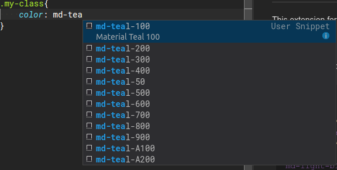

# Material Color Snippets for VS Code

This extension for Visual Studio Code adds snippets for material colors.



## Usage
Type part of a snippet, press `enter`, and the snippet unfolds.

```css
md-red-*
md-pink
md-purple-*
md-deep-purple-*
md-indigo-*
md-blue-*
md-light-blue-*
md-cyan-*
md-teal-*
md-green-*
md-light-green-*
md-lime-*
md-yellow-*
md-amber-*
md-orange-*
md-deep-orange-*
md-brown-*
md-grey-*
md-blue-grey-*
md-black
md-white
```

## Languages

You can use this snippets in
- *.scss
- *.css
- *.less
- *.vue

[Read More](https://material.google.com/style/color.html) about Material Color

Alternatively, press `Ctrl`+`Space` (Windows, Linux) or `Cmd`+`Space` (OSX) to activate snippets from within the editor.

## Installation

1. Install Visual Studio Code 0.10.1 or higher
2. Launch Code
3. From the command palette `Ctrl`-`Shift`-`P` (Windows, Linux) or `Cmd`-`Shift`-`P` (OSX)
4. Select `Install Extension`
5. Choose the extension
6. Reload Visual Studio Code
